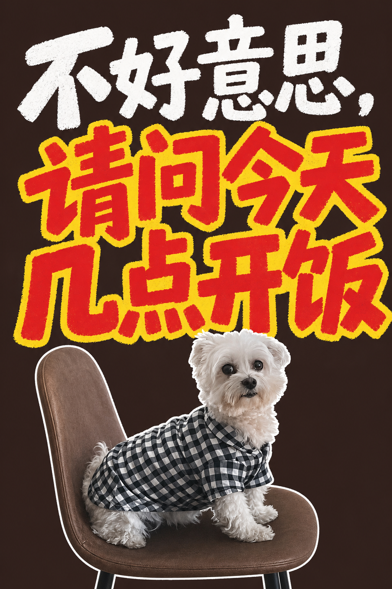

# handwritten-xhs-cover

原图 + 标题 → 抠主体 → 并行 **3 种封面风格**：

1. **夸张大字** — 标题霸屏 + 放大主体 · 字体 `typography-outline`
2. **手绘小清新** — doodle + 描边主体 · 字体 `typography-scattered`
3. **色块拼贴** — 大色块 + sticker 主体 · 字体 `typography-marker`

## 效果展示

原图：白狗穿格子衫等开饭 · 标题：**不好意思，请问今天几点开饭**

| 夸张大字 | 手绘小清新 | 色块拼贴 |
|:---:|:---:|:---:|
|  |  |  |
| `exaggerated_headline` | `doodle_fresh` | `color_block` |

## Cursor

```
@handwritten-xhs-cover 用这张原图，标题「不好意思，请问今天几点开饭」
```

克隆到 `.cursor/skills/handwritten-xhs-cover/` 或打开本仓库即可。

## 参考资源

- 封面构图：`references/covers/`（11 张）
- 手写字体：`references/typography-*.jpg`（4 张，每 preset 绑定 1 张）
- 配色：各 preset 固定色板（见 `prompts/generate-poster.md`）

详细安装见 [INSTALL.md](./INSTALL.md)。

MIT
